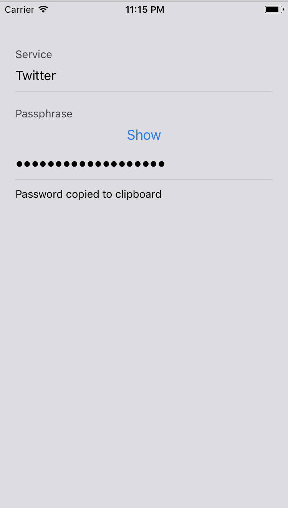

# Vault mobile

- [Intro](#intro)
- [Install](#install)
- [Development](#development)

### Intro

Using 1password? Great. But unless you use it only on offline mode your
passwords are now managed by a third-party corporation. Should you trust them?
No. Trust no one.

[Vault](https://github.com/jcoglan/vault/) is designed to be stateless, that is,
your passwords are not stored anywhere. All you need is to remember one
passphrase. The combination of this passphrase and the service name (e.g.
"twitter") will generate a unique and safe password for you.

Vault native is a simple native UI on top of
[vault](https://github.com/jcoglan/vault/) using
[react native](https://facebook.github.io/react-native/).

For a desktop version check [vault-desktop](https://github.com/joaomilho/vault-desktop).

Check it out:



### Install

Not yet published in the app/google store :/

You'll have to install in your phone manually for now.

### Development

```bash
# Clone this repository
git clone https://github.com/joaomilho/vault-native
# Go into the repository
cd vault-native
# Install dependencies
yarn install
# Run the app
yarn start
```

## License

[CC0 1.0 (Public Domain)](LICENSE.md)
